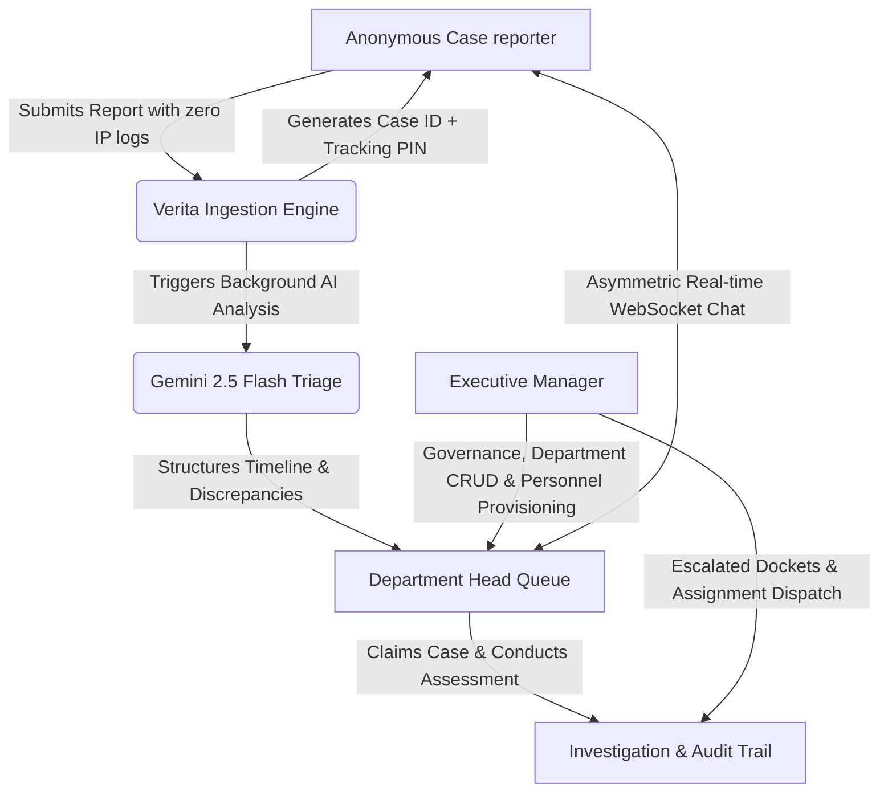

# Verita — Enterprise Case reporter & Case Management System (Frontend)

[](https://vuejs.org/)
[](https://www.typescriptlang.org/)
[](https://vitejs.dev/)
[](https://tailwindcss.com/)
[](LICENSE)

The official Vue 3 frontend application for **Verita**, an enterprise-grade platform for anonymous workplace misconduct reporting, AI-assisted triage, secure evidence management, and multi-role investigation workflows.

**Lead Developer & Architect:** [Carmine Akanabe](https://github.com/CarmineAkanabe)  
**Backend API Repository:** [CarmineAkanabe/verita-api](https://github.com/CarmineAkanabe/verita-api)

---

## 🌟 What is Verita?

In many organizations, reporting ethical violations, procurement fraud, harassment, or financial irregularities is difficult. Traditional channels often lack privacy, exposing Case reporters to career retaliation or interpersonal conflict.

**Verita** provides an air-gapped, cryptographically isolated platform that balances **guaranteed Case reporter anonymity** with **rigorous investigative accountability**:
- Case reporters can submit incident reports without creating accounts or revealing IP addresses.
- An AI engine (Google Gemini) structures disclosures into objective timelines and highlights red flags.
- Dedicated Department Heads review evidence, communicate with reporters in real-time, and record status transitions.
- Executive Managers oversee organization-wide trends, assign dockets, and govern compliance via immutable audit ledgers aligned with **ISO 37002:2021 Whistleblowing Management Systems**.

---

## 👥 Three Core Stakeholder Portals



### 1. Anonymous Case Reporter Portal
- **Zero-Log Intake Wizard**: A multi-step form capturing incident categories (`FRAUD`, `HARASSMENT`, `SECURITY`, `OTHER`), involved parties, financial transaction details, and encrypted multi-file evidence uploads.
- **Credential Card**: Generates an instantaneous Case ID and 6-character cryptographic tracking PIN.
- **Reporter Dashboard (`/cases/me`)**:
  - Real-time case status tracking (`SUBMITTED`, `AI_PROCESSING`, `AWAITING_REVIEW`, `UNDER_INVESTIGATION`, `RESOLVED`, `DISMISSED`).
  - AI Executive Summary, synthesized timeline events, and risk indicators.
  - Supplementary evidence upload and private download streams.
  - One-click case escalation directly to Executive Management if an investigator is unresponsive.
- **Anonymous Consultation Channel (`/cases/me/chat`)**:
  - Live two-way WebSocket messaging powered by Laravel Reverb.
  - Total identity isolation: the investigator cannot see the reporter's device, presence, or name.

### 2. Department Head Investigation Portal
- **Departmental Triage Queue (`/app/cases`)**: Filter by status and incident category. Unclaimed dockets can be claimed with one click.
- **Comprehensive Case View (`/app/cases/:id`)**:
  - Full disclosure narrative and forensic evidence gallery.
  - In-browser preview modal for documents and image evidence.
  - AI Findings card highlighting factual discrepancies and chronological event sequences.
- **Status Lifecycle Control**:
  - Transition cases from `UNDER_INVESTIGATION` to `RESOLVED`, `CLOSED`, or `DISMISSED`.
  - Mandatory forensic investigation note required on every status change.
  - Executive resolution summary required for case closures.
- **Live Consultation Chat (`/app/cases/:id/chat`)**: Asymmetric communication channel directly with the anonymous Case reporter.
- **Case History & Immutable Audit Trail**: Detailed chronological timeline of every status transition, forensic note, AI evaluation, and evidence inspection.

### 3. Executive Manager Console
- **Organization Case Oversight (`/app/cases`)**: View and manage all cases across all departments.
- **Interactive Assignment Modal**: Assign unassigned incident reports to specific Department Heads, with live presence status indicators.
- **Department Management (`/app/departments`)**: Full CRUD controls for corporate departments and directorates.
- **Personnel Management (`/app/department-heads`)**: Provision, edit, and manage Department Head accounts with instant password toggles and resilient avatar fallbacks.
- **Engagement Reports & Analytics (`/app/reports/user-engagement`)**:
  - Key performance indicators: Total cases handled, average resolution speed, and top incident types.
  - Horizontal distribution progress bars showing case volume by department.
  - Monthly activity trends grouped by classification.
  - One-click **Print Executive Report** (`window.print()`).
- **Cryptographic Audit Ledger**: High-level ledger verifying system integrity and ISO 37002 compliance.

---

## 🎨 Visual Design & UI System

Verita features a **warm, creamy corporate aesthetic** designed to evoke institutional trust, clarity, and elegance:
- **Canvas Background**: Soft warm off-white (`#F7F8FA` / `oklch(0.982 0.005 90)`).
- **Creamy Cards (`.card-creamy`)**: Warm ivory `#F8F3EA` with subtle border `#E2D5C3`.
- **Primary Accent**: Report Orange `#A2561B` (WCAG AA compliant, high-contrast).
- **Executive Navy**: Deep corporate navy `#22293A` for headers, badges, and sidebars.
- **Plain, Human Language**: Avoids legalistic jargon ("Dossier", "Jurisprudence") in favor of clear, transparent terminology.

### Accessibility (WCAG AA)
- **Dual Icon + Text Pairing**: Status badges never rely on color alone (e.g. `ClockIcon` for Submitted, `CheckCircle2Icon` for Resolved, `SearchIcon` for Under Investigation).
- **Keyboard Focus Rings**: Visible `:focus-visible` rings (`ring-2 ring-primary/80 ring-offset-2`) across all buttons, form fields, and navigation links.

---

## 🛡️ Reliability, Offline & Error Recovery Architecture

- **Global Network Status Banner (`NetworkStatusBanner.vue`)**:
  - Mounted globally in `App.vue`.
  - Automatically detects browser offline events (`window.navigator.onLine`).
  - Listens to Laravel Reverb WebSocket connection drops (`connecting`, `unavailable`, `failed`) and provides an instant one-click **Reconnect** button.
  - Displays a clean green confirmation toast when connectivity is restored.
- **Dedicated Branded Error Pages**:
  - **401 Unauthorized (`/unauthorized`)**: Dual recovery paths for Staff Sign In and Anonymous PIN Tracking.
  - **403 Access Restricted (`/forbidden`)**: Clear explanation of role air-gapping when a user attempts to access an unauthorized partition.
  - **500 Service Interrupted (`/server-error`)**: Guarantees atomic transaction safety and provides a **Retry Connection** trigger.
  - **404 Not Found (`/404`)**: Contextual fallback navigation to report submission and home.

---

## 📁 Project Architecture

```
verita-vue/
├── public/                     # High-resolution assets & brand emblem
│   ├── hero-enterprise.jpg     # Corporate hero photography
│   ├── case-study-digimark.jpg # Digimark customer spotlight
│   ├── security-operations.jpg # Security operations showcase
│   └── verita.png              # Verita Owl crest
├── src/
│   ├── components/
│   │   ├── common/             # Reusable UI primitives (AppButton, StatusPill, EmptyState, etc.)
│   │   │   ├── NetworkStatusBanner.vue # Universal offline & websocket banner
│   │   │   └── StatusPill.vue  # Accessible WCAG AA status badges
│   │   ├── complex/            # Modal dialogs (AssignCaseModal, DepartmentModal, etc.)
│   │   └── ui/                 # Shadcn-vue / Reka UI base primitives
│   ├── features/               # Domain-driven feature modules
│   │   ├── cases/              # Case intake, detail, status updates, and audit logs
│   │   ├── chat/               # Real-time WebSocket messaging store & actions
│   │   └── manager/            # Manager API clients (departments, accounts, reports)
│   ├── layouts/                # Shell layouts (PublicLayout, DashboardLayout, AuthLayout, ErrorLayout)
│   ├── pages/                  # Route views
│   │   ├── auth/               # Staff login and Reporter PIN verification
│   │   ├── cases/              # Intake submission, Reporter dashboard, and Reporter chat
│   │   ├── error/              # 401, 403, 404, 500 recovery pages
│   │   ├── public/             # Home and About Us (with Carmine Akanabe developer credit)
│   │   └── staff/              # Staff dashboard, profile, notifications, and manager views
│   ├── shared/                 # Core shared utilities, axios client, auth store, and realtime Echo client
│   ├── router/                 # Vue Router configuration & role-based guards
│   ├── style.css               # Tailwind CSS v4 configuration & design tokens
│   └── App.vue                 # Application root with Toaster and NetworkStatusBanner
└── package.json
```

---

## 🚀 Getting Started

### Prerequisites
- **Node.js**: 20.x or higher
- **npm** or **pnpm**
- **Verita Backend API** running on `http://localhost:8000`
- **Laravel Reverb WebSocket Server** running on `localhost:8080`

### 1. Installation
```bash
git clone https://github.com/CarmineAkanabe/verita-vue.git
cd verita-vue
npm install
```

### 2. Environment Configuration
Create a `.env` file in the root directory:
```env
# Backend API Base URL
VITE_API_ORIGIN=http://localhost:8000

# Laravel Reverb WebSocket Configuration
VITE_REVERB_APP_KEY=eafnuy9gwxipsopxuepc
VITE_REVERB_HOST=localhost
VITE_REVERB_PORT=8080
VITE_REVERB_SCHEME=http
```

### 3. Running Development Server
```bash
npm run dev
```
The application will launch locally at `http://localhost:5173`.

### 4. Production Build & Verification
```bash
npm run build
```
Executes TypeScript type-checking (`vue-tsc -b`) followed by optimized production bundling via Vite.

---

## 🔑 Demo & Testing Credentials

| Role                   | Email                     | Password   | Access Scope                                                                                        |
| ---------------------- | ------------------------- | ---------- | --------------------------------------------------------------------------------------------------- |
| **Executive Manager**  | `manager@verita.com`      | `password` | Full organization oversight, case assignments, departments, personnel accounts, and analytics.      |
| **Department Head**    | `depthead@verita.com.com` | `password` | Departmental intake queue, case claiming, evidence review, live chat, and audit trail.              |
| **Anonymous Reporter** | *No login needed*         | *N/A*      | Submit a report at `/cases/submit` or track an existing report with its PIN at `/cases/verify-pin`. |

---

## 📜 Standard Compliance & Provenance

Verita is engineered to meet the operational criteria of:
- **ISO 37002:2021** (Whistleblowing Management Systems)
- **EU Case reporter Protection Directive 2019/1937**
- **WCAG 2.1 Level AA** (Web Content Accessibility Guidelines)

Developed by **[Carmine Akanabe](https://github.com/CarmineAkanabe)** for final university defense and modern enterprise implementation. Open-source under the **MIT License**.
